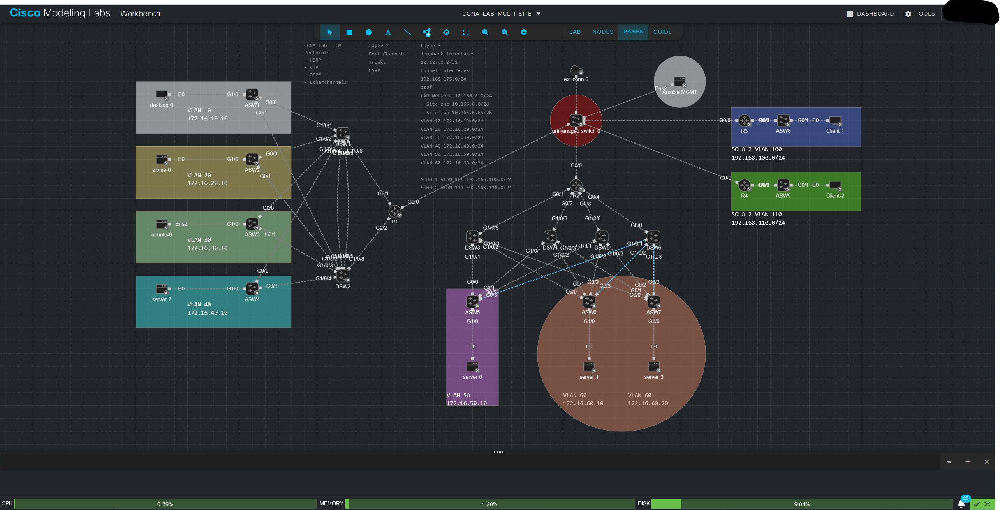

# Multi Site Lab

This lab practice lab goes over the following protocols:
- VTP
- OSPF
- HSRP
- Port Channels
- VPN Tunnels
- EIGRP
- DHCP
- NTP
- NAT
- STP
- VLAN
  
# Configs Directory

This directory contains all configuration commands needed to stand up the lab. This section is a work in progress and will update as I configure additional protocols until the topology is complete. 

# To Do:
- Complete configuration files
  - Site One
    - ASW1
    - ASW2
    - ASW3
    - ASW4
    - DSW1
    - DSW2
    - R1
  - Site Two
    - ASW5
    - ASW6
    - ASW7
    - DSW3
    - DSW4
    - DSW5
    - DSW6
    - R2
  - Soho 1
    - ASW8
    - R3
  - Soho 2
    - ASW9
    - R4
- Configure Dynamic Routing Protocols
- Configure External Access
- Configure Tunnel Interfaces and link up all sites to DC (Site 2)
  
